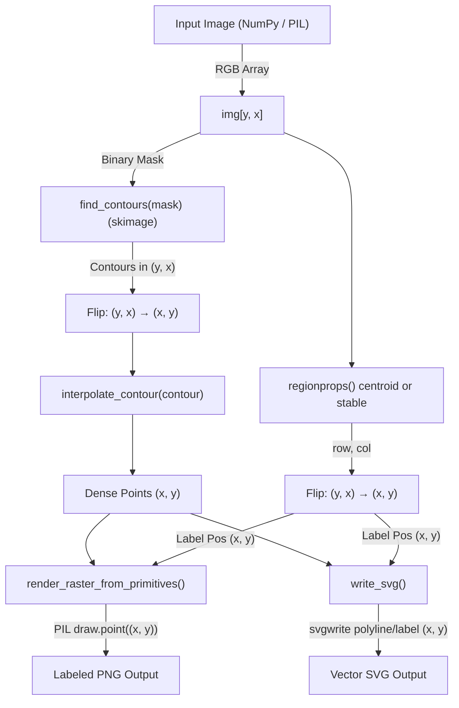

# PbnPy: Python Paint-By-Number Generator

**PbnPy** is a command-line tool that converts any image into a printable, paint-by-number guide. It reduces images to a fixed color palette, segments the result into paintable regions, overlays numeric labels, and generates both raster and vector outputs along with a color swatch legend.

## Features

- Converts any image into paint-by-number format
- Style preprocessing: `blur`, `pixelate`, `mosaic`
- Complexity presets for beginner to master-level detail
- Label placement modes: `diagonal`, `centroid`, `stable`
- Custom font support for overlays and legend
- Vector (SVG) and raster (PNG) output
- Optional fixed-palette matching from a source image
- Fully command-line driven with rich configuration

## Installation

Requires Python 3.7+

```bash
pip install -r requirements.txt
```

Dependencies:
- `Pillow`
- `typer`
- `numpy`
- `scikit-learn`
- `scipy`
- `scikit-image`

## Usage

### Quick Start

```bash
python pbnpy input.jpg --output-dir out
```
This uses the intermediate complexity preset and default KMeans color quantization.

### Full Example
```bash
python pbnpy input.jpg --output-dir ./out \
  --complexity intermediate \
  --style pixelate \
  --label-mode diagonal \
  --font ./fonts/DejaVuSansMono.ttf \
  --palette-from swatches.jpg \
  --yes
```

## Output Files

- `out/quantized.png` — color-reduced version of the input
- `out/labeled.png` — raster image with labeled regions
- `out/vector.svg` — vectorized paint-by-number guide
- `out/legend.png` — swatch legend with corresponding numbers

## Options

| Flag             | Description                                                                 |
|------------------|-----------------------------------------------------------------------------|
| `--complexity`   | Preset detail level: `beginner`, `intermediate`, `master`                  |
| `--style`        | Preprocessing style: `blur`, `pixelate`, `mosaic`                          |
| `--label-mode`   | Label placement strategy: `diagonal` (default), `centroid`, `stable`       |
| `--num-colors`   | Manually set number of colors (overrides preset)                           |
| `--palette-from` | Use an external image as a fixed palette source                            |
| `--font`         | Path to a `.ttf` font file                                                  |
| `--font-size`    | Font size for region labels                                                 |
| `--tile-spacing` | Distance between repeated labels within a region                           |
| `--swatch-size`  | Width/height of each swatch in the legend                                  |
| `--legend-height`| Height of the swatch legend image                                           |
| `--skip-legend`  | Skip generation of the legend image                                         |
| `--yes` / `-y`   | Overwrite existing output files without prompting                          |

### Complexity Presets

| Name         | Colors | Tile Spacing | Font Size |
|--------------|--------|---------------|------------|
| `beginner`   | 6      | 40px          | 14         |
| `intermediate` | 12   | 30px          | 12         |
| `master`     | 24     | 20px          | 10         |

### Style Options

| Name       | Description                              |
|------------|------------------------------------------|
| `blur`     | Applies a Gaussian blur                  |
| `pixelate` | Chunky low-resolution pixelation         |
| `mosaic`   | Pixelate and upscale for blended effect  |

### Label-modes (placement strategies)
`diagonal` (default) 
- instantaneous label placement
- a little sloppy about it
  
`centroid` 
- label placement only in the centroid of the region
- probably good for only very simple geometric shapes and images
- slightly slower than diagonal's scorched earth placement

`stable`
- find the most 'stable' label location within a binary region.
- a stable location is one that is most deeply surrounded by the same value in all four cardinal directions.
- probably optimal placement, but far slower than the others

### Pipeline Diagram
The coordinates normalization and transformations have made the pipeline far more complex than it started or I intended. Thanks to ChatGPT's mermaid diagramming skills, we can visualize the pipeline like this:


## Painterliness is next to ~~Godli~~Working

The `blobbify` branch has the early stages of getting more painterly output and end results if that sort of thing interests you.


## License

MIT
