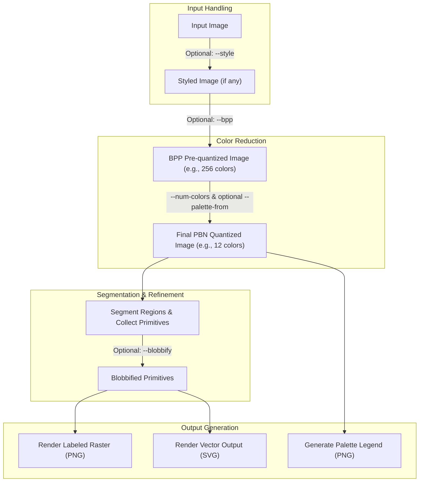

# PbnPy: Python Paint-By-Number Generator

**PbnPy** is a command-line tool that converts any image into a printable, paint-by-number guide. It reduces images to a fixed color palette, segments the result into paintable regions, overlays numeric labels, and generates both raster and vector outputs along with a color swatch legend.

## Features

- Converts any image into paint-by-number format.
- **Two-stage color quantization:**
    - Optional initial global color reduction using Bits Per Pixel (`--bpp`).
    - Final PBN palette generation using a specific number of colors (`--num-colors`).
- Style preprocessing: `blur`, `pixelate`, `mosaic`.
- Complexity presets for beginner to master-level detail.
- Label placement modes: `diagonal`, `centroid`, `stable`.
- Custom font support for overlays and legend.
- Vector (SVG) and raster (PNG) output.
- Optional fixed-palette matching from a source image (can also be pre-quantized with `--bpp`).
- Fully command-line driven with rich configuration.

## Installation

Requires Python 3.7+

```bash
pip install -r requirements.txt
```

Dependencies:
- `Pillow`
- `typer[all]` (for rich tracebacks and shell completion, if desired)
- `numpy`
- `scikit-learn`
- `scipy`
- `scikit-image`
- `rich` (for enhanced console output)

## Usage

The script is invoked directly, followed by options, the input image file, and the output directory.

**General Syntax:**
```bash
python pbnpy.py [OPTIONS] INPUT_FILE OUTPUT_DIRECTORY
```

### Quick Start

```bash
python pbnpy.py my_photo.jpg ./pbn_output
```
This command processes `my_photo.jpg`, saves outputs to the `./pbn_output` directory, and uses default settings (typically 12 colors for the PBN palette, intermediate complexity).

### Full Example

```bash
python pbnpy.py "Vacation Pic.png" "./Vacation PBN" \
  --style mosaic \
  --bpp 8 \
  --num-colors 16 \
  --complexity master \
  --palette-from "artist_palette.png" \
  --font-path "./fonts/Arial.ttf" \
  --label-mode stable \
  --blobbify \
  --blob-min 5 \
  --dpi 300 \
  --yes
```
This example:
- Processes `"Vacation Pic.png"` and outputs to `"./Vacation PBN"`.
- Applies a `mosaic` style.
- First, pre-quantizes the input image (and `artist_palette.png`) to an 8-bit (256 colors) palette using `--bpp 8`.
- Then, generates the final PBN using 16 colors (`--num-colors 16`), derived from the pre-quantized `artist_palette.png`.
- Uses the `master` complexity settings (which might influence defaults if `--num-colors` wasn't specified).
- Uses a custom font (`Arial.ttf`) and the `stable` label mode.
- Applies `blobbify` for a painterly effect with 5mm² minimum blob size, using 300 DPI for calculations.
- Overwrites existing files without prompting.

## Output Files

Assuming `OUTPUT_DIRECTORY` is `out/`:

- **Final PBN Files:**
    - `out/quantized_pbn.png`: The input image reduced to the final PBN color palette (e.g., 12 colors). This is the image used for segmentation.
    - `out/labeled.png`: The main raster (PNG) paint-by-number guide with outlines and numeric labels.
    - `out/vector.svg`: A vector (SVG) version of the paint-by-number guide (if not `--raster-only`).
    - `out/legend.png`: A color swatch legend mapping numbers to the final PBN palette colors (if not `--skip-legend`).

- **Intermediate Files (may be present in the output directory):**
    - `out/styled_input.png`: If a `--style` is applied.
    - `out/bpp_quantized_input.png`: If `--bpp` is used, this is the input image after the initial BPP color reduction.
    - `out/bpp_quantized_palette_source.png`: If `--bpp` and `--palette-from` are used, this is the palette source image after BPP reduction.

## Options

| Flag                          | Description                                                                                                                               | Default        |
|-------------------------------|-------------------------------------------------------------------------------------------------------------------------------------------|----------------|
| `INPUT_FILE`                  | (Positional) Path to the input image file.                                                                                                | **Required** |
| `OUTPUT_DIRECTORY`            | (Positional) Path to the directory where output files will be saved.                                                                      | **Required** |
| `--complexity TEXT`           | Preset detail level: `beginner`, `intermediate`, `master`. Affects defaults for `num-colors`, `tile-spacing`, `font-size`.                | `None`         |
| `--style TEXT`                | Preprocessing style to apply to the input image: `blur`, `pixelate`, `mosaic`.                                                            | `None`         |
| `--num-colors INTEGER`        | Final number of colors for the PBN palette.                                                                                               | 12             |
| `--bpp INTEGER`               | Bits Per Pixel (1-8) for an *initial* color depth reduction (e.g., 8 for 256 colors). Applied before `--num-colors` processing.            | `None`         |
| `--palette-from FILE_PATH`    | Path to an image to extract a fixed palette from for the final PBN colors. This image is also subject to `--bpp` pre-quantization.        | `None`         |
| `--font-path FILE_PATH`       | Path to a `.ttf` font file for labels and legend.                                                                                         | System default |
| `--font-size INTEGER`         | Base font size for overlay labels and legend text.                                                                                        | 12             |
| `--label-mode TEXT`           | Label placement strategy: `diagonal`, `centroid`, `stable`.                                                                               | `diagonal`     |
| `--tile-spacing INTEGER`      | Approximate distance (pixels) between repeated number labels in a large region.                                                           | 30             |
| `--swatch-size INTEGER`       | Width/height (pixels) of each color swatch in the legend.                                                                                 | 40             |
| `--skip-legend` / `--no-skip-legend` | If set, skips generating the palette legend image.                                                                               | `False`        |
| `--raster-only` / `--no-raster-only` | Only generate raster output (labeled PNG); skip vector SVG output.                                                                 | `False`        |
| `--yes` / `-y`                | Automatically overwrite existing output files without prompting.                                                                          | `False`        |
| `--blobbify` / `--no-blobbify`| Enable painterly splitting of color regions into smaller, more organic 'blobs'.                                                          | `False`        |
| `--blob-min INTEGER`          | Minimum blob area in mm² (used if `--blobbify` is active).                                                                                | 3              |
| `--blob-max INTEGER`          | Maximum blob area in mm² (used if `--blobbify` is active).                                                                                | 30             |
| `--min-label-font INTEGER`    | Minimum font size allowed for blob labeling if `--blobbify` is active.                                                                    | 8              |
| `--interpolate-contours` / `--no-interpolate-contours` | Interpolate contour lines for smoother appearance. Disable for simpler SVGs.                                    | `True`         |
| `--dpi INTEGER`               | Dots Per Inch (DPI) for mm² to pixel conversion (used with `--blobbify`). Overrides DPI from image metadata if provided.                | Auto or 96     |
| `-h`, `--help`                | Show the help message and exit.                                                                                                           |                |

### Understanding `--bpp` vs `--num-colors`

These two options control color reduction at different stages:

1.  **`--bpp INTEGER` (Initial Pre-quantization):**
    * If provided, this option performs an *initial* global color reduction on the input image (and the `--palette-from` image, if used).
    * It quantizes the image(s) to `2^BPP` colors (e.g., `--bpp 8` results in 256 colors).
    * This step is useful for:
        * Standardizing the color palette of diverse input images before PBN-specific processing.
        * Working within a constrained color space if the original image has an extremely high number of colors.
        * Ensuring that a user-supplied palette (via `--palette-from`) is considered from within this same reduced color space.
    * The output of this stage (if `--bpp` is used) becomes the input for the next stage.

2.  **`--num-colors INTEGER` (Final PBN Palette Size):**
    * This determines the number of colors that will be in your *final paint-by-number palette*.
    * The PBN quantization process (using scikit-learn's KMeans or a fixed palette from `--palette-from`) will reduce the (potentially BPP-pre-quantized) image to this many colors.
    * This is the number of distinct paints you'll need.

**Example Flow:**
`INPUT_IMAGE (e.g., 24-bit color)`
  `--bpp 8` → `INTERMEDIATE_IMAGE_1 (256 colors)`
    `--num-colors 16` (using KMeans on INTERMEDIATE_IMAGE_1) → `FINAL_PBN_IMAGE (16 colors for painting)`

If `--palette-from MY_PALETTE.PNG` is also used with `--bpp 8` and `--num-colors 16`:
`INPUT_IMAGE` → `INTERMEDIATE_INPUT (256 colors)`
`MY_PALETTE.PNG` → `INTERMEDIATE_PALETTE_SOURCE (256 colors)`
  Then, 16 colors are extracted from `INTERMEDIATE_PALETTE_SOURCE` and used to quantize `INTERMEDIATE_INPUT` to the `FINAL_PBN_IMAGE (16 colors)`.

### Complexity Presets

| Name         | PBN Colors | Tile Spacing | Font Size |
|--------------|------------|--------------|-----------|
| `beginner`   | 6          | 40px         | 14        |
| `intermediate`| 12         | 30px         | 12        |
| `master`     | 24         | 20px         | 10        |
*(These presets set defaults; explicit options like `--num-colors` will override them.)*

### Style Options

| Name       | Description                              |
|------------|------------------------------------------|
| `blur`     | Applies a Gaussian blur.                 |
| `pixelate` | Chunky low-resolution pixelation.        |
| `mosaic`   | Pixelate and upscale for blended effect. |

### Styling Options and Parameters

The `--style TEXT` option allows you to apply a visual preprocessing effect to your input image. The available styles are `blur`, `pixelate`, and `mosaic`. You can further control the intensity or characteristics of these styles using the following parameters:

| Style Selected      | Parameter Flag              | Description                                                                                                        | Default Behavior (if flag not used)                                    |
|---------------------|-----------------------------|--------------------------------------------------------------------------------------------------------------------|------------------------------------------------------------------------|
| `--style blur`      | `--blur-radius INTEGER`     | Sets the radius for the Gaussian blur effect. Higher values increase blurriness. Must be a positive integer.        | `4` (as defined in the `stylize` module)                             |
| `--style pixelate`  | `--pixelate-block-size INTEGER` | Sets the size (in pixels) of the blocks for the pixelation effect. Must be a positive integer.                  | Dynamically calculated: `max(4, min(image_width, image_height) // 64)` |
| `--style mosaic`    | `--mosaic-block-size INTEGER` | Sets the size (in pixels) of the blocks for the mosaic effect. Must be a positive integer.                         | Dynamically calculated: `max(4, min(image_width, image_height) // 64)` |

**How to Use:**

First, select a style with `--style <style_name>`, then optionally add its corresponding parameter flag. For example:

* To apply a blur with a radius of 7:
    ```bash
    python pbnpy.py input.jpg ./output --style blur --blur-radius 7
    ```

* To apply pixelation with a block size of 10 pixels:
    ```bash
    python pbnpy.py input.jpg ./output --style pixelate --pixelate-block-size 10
    ```

* To apply the mosaic effect with its default (dynamically calculated) block size:
    ```bash
    python pbnpy.py input.jpg ./output --style mosaic
    ```

If you specify a style parameter flag (e.g., `--blur-radius`) without the corresponding `--style` flag (e.g., `--style blur`), the parameter flag will be ignored as no style is being applied. The parameter flags are only active when their associated style is selected.

### Label Modes (Placement Strategies)

-   `diagonal` (default): Fast, places labels on a diagonal grid within regions. Can sometimes be dense.
-   `centroid`: Places a single label at the geometric center of each region. Best for simple, convex shapes.
-   `stable`: Finds the most "stable" point within each region (deepest inside the color). Often gives good placement but is significantly slower.

### Pipeline Diagram
The image processing pipeline involves several stages:



## Painterly Output with `--blobbify`

The `--blobbify` feature allows for a more artistic, "painterly" result by subdividing large, uniform color regions into smaller, more organically shaped "blobs." This can simulate the appearance of individual brushstrokes.

### Description

When `--blobbify` is used, after the initial color segmentation, contiguous regions of the same color are further processed. They are broken down into smaller blobs, with the size and number of blobs influenced by the `--blob-min` and `--blob-max` area settings (in mm², converted to pixels using DPI).

Blobs that are too small to legibly fit a label (based on `--min-label-font`) are merged with suitable adjacent blobs to ensure all painted areas can be identified.

### Blobbify Flags

| Flag                | Description                                                                 | Default |
|---------------------|-----------------------------------------------------------------------------|---------|
| `--blobbify`        | Enable painterly splitting of color regions.                                | `False` |
| `--blob-min`        | Minimum blob area in mm² (converted to pixels using DPI).                   | 3       |
| `--blob-max`        | Maximum blob area in mm² (converted to pixels using DPI).                   | 30      |
| `--min-label-font`  | Minimum font size (points) required for a blob to receive its own label.    | 8       |
| `--dpi`             | DPI used for mm² to pixel conversion for blob sizing. Uses image metadata or defaults to 96 if not set. | Auto/96 |

### Blobbify Example

```bash
python pbnpy.py "landscape.png" "./landscape_pbn_blobs" \
  --num-colors 20 \
  --blobbify \
  --blob-min 4 \
  --blob-max 25 \
  --min-label-font 9 \
  --dpi 150 \
  --font-path "./fonts/ComicSans.ttf" \
  --yes
```
This generates a PBN for `landscape.png` with 20 final colors, where regions are blobbified into sizes roughly between 4mm² and 25mm² (calculated at 150 DPI), and labels use Comic Sans with a minimum size of 9pt.

## License

MIT