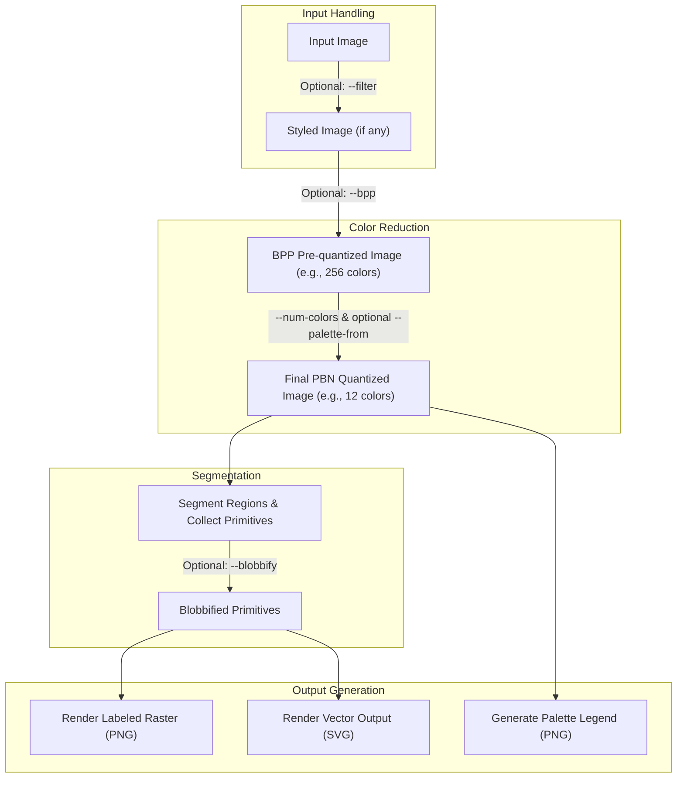

# PbNgen: the Python Paint-By-Number Generator

[Pb](https://wikipedia.com/wiki/lead)Ngen, (that's PbN as in paint-by-numbers, gen as in generator. Or Pb as in "lead" as in paint, and Ngen as in engine; one might call it The LeadEngine, but I don't expect anyone to call it anything other than pbngen) is a command-line tool that converts any image into a printable, paint-by-number guide. It reduces images to a fixed color palette, segments the result into paintable regions, overlays numeric labels, and generates both raster and vector outputs along with a color swatch legend.

[Examples complete with input and output images are available on the Wiki](https://github.com/scottvr/pbngen/wiki)

## Features

- Converts any image into paint-by-number format.
- Two-stage color quantization:
    - Optional initial global color reduction using Bits Per Pixel (`--bpp`).
    - Final PBN palette generation using a specific number of colors (`--num-colors`).
- Filter preprocessing: `blur`, `pixelate`, `mosaic`, painterly and smoothing filters.
- Complexity presets for beginner to master-level detail.
- Label placement strategies: `diagonal`, `centroid`, `stable`.
- Custom font support for overlays and legend.
- Vector (SVG) and raster (PNG) output.
- Optional fixed-palette matching from a source image (can also be pre-quantized with `--bpp`).
- Fully command-line driven with rich configuration.
- GPU (Nvidia CUDA) support!

## Installation

Requires Python 3.7+

```bash
pip install -r requirements.txt
```

**Note: if using GPU, please ensure you have CUDA correctly configured, and you will need to `pip install cupy` if it isn't already in your environment.**

Windows users: see [section on GPU under WSL](#note-concerning-scikit-learn-cuml-gpu-acceleration-on-windows)
## Usage

The script is invoked directly, followed by options, the input image file, and the output directory.

**General Syntax:**
```bash
python pbngen.py [OPTIONS] INPUT_FILE OUTPUT_DIRECTORY
```

### Quick Start

```bash
python pbngen.py my_photo.jpg ./pbn_output
```
This command processes `my_photo.jpg`, saves outputs to the `./pbn_output` directory, and uses default settings (typically 12 colors for the PBN palette, intermediate preset).

[Examples complete with input and output images are available on the Wiki](https://github.com/scottvr/pbngen/wiki)

See [Tips for Best Results](#tips-for-best-results) further down in this README.

### More Complex Example

```bash
python pbngen.py "Vacation Pic.png" "./Vacation PBN" \
  --filter mosaic \
  --bpp 8 \
  --num-colors 16 \
  --preset master \
  --palette-from "artist_palette.png" \
  --font-path "./fonts/Arial.ttf" \
  --label-strategy stable \
  --blobbify \
  --blob-min 5 \
  --dpi 300 \
  --yes
```
This example:
- Processes `"Vacation Pic.png"` and outputs to `"./Vacation PBN"`.
- Applies a `mosaic` filter.
- First, pre-quantizes the input image (and `artist_palette.png`) to an 8-bit (256 colors) palette using `--bpp 8`.
- Then, generates the final PBN using 16 colors (`--num-colors 16`), derived from the pre-quantized `artist_palette.png`.
- Uses the `master` preset settings (which might influence defaults if `--num-colors` wasn't specified).
- Uses a custom font (`Arial.ttf`) and the `stable` label mode.
- Applies `blobbify` for a painterly effect with 5mm² minimum blob size, using 300 DPI for calculations.
- Overwrites existing files without prompting.

## Output Files

Assuming `OUTPUT_DIRECTORY` is `out/`:

- **Final PBN Files:**
    - `out/pbn_guide-ncolor_quantized.png`: The input image reduced to the final PBN color palette (e.g., 12 colors). This is the image used for segmentation and is a fair representation of what your painting should look like when completed.
    - `out/raster-pbn_canvas.png`: The main raster (PNG) paint-by-number guide with outlines and numeric labels.
    - `out/vector-pbn_canvas.svg`: A vector (SVG) version of the above (if not `--raster-only`). This is what you'll want to use if you are sending the image to a print shop for otuput to a large canvas since vector graphics scale without losing fidelity.
    - `out/palette-pbn_legend.png`: A color swatch legend mapping numbers to the final PBN palette colors (if not `--skip-legend`).

- **Intermediate Files (may be present in the output directory):**
    - `out/filtered_input.png`: If a `--filter` is applied.
    - `out/input-bpp_quantized.png`: If `--bpp` is used, this is the input image after the initial BPP color reduction.
    - `out/bpp_quantized_palette_input.png`: If `--bpp` and `--palette-from` are used, this is the palette source image after BPP reduction.

 **Note: the intermediate files can be automatically cleaned up (deleted) by passing the --no-cruft flag on the command-line.**

### Embedded File Metadata

PBNgen automatically embeds useful metadata directly into the output PNG and SVG files it generates. This feature helps you keep track of precisely how each file was created, making it easier to manage different versions or reproduce results without relying on complex filenames or separate notes.

**What Information is Stored?**

For each generated PNG and SVG file, PBNgen typically embeds:

* **Full Command-Line Invocation:** The exact command, options, and arguments you used to run `pbngen` for that specific file. This is stored with a key like `pbngen:command_line` (PNG) or in a `CommandLineInvocation` tag (SVG).
* **Processing Details:** Context-specific information about the generation process. This can include:
    * `PBNgen-FileType`: The role of the generated file (e.g., "Labeled Raster PBN Output", "Vector PBN Canvas", "BPP Pre-quantized Input").
    * Source file paths (e.g., `SourceImage`, `SourceQuantizedGuide`).
    * Key parameters used (e.g., `PaletteColors`, `BPP`, `TargetCanvasSize`, `LabelStrategy`, `FontSize`).
    * Other relevant settings.

**How and Where Metadata is Stored:**

* **PNG Files:** Metadata is embedded as text chunks within the PNG file structure. Keys for this information are generally prefixed with `pbngen:` (e.g., `pbngen:PBNgen-FileType`). You can often view these text chunks using metadata inspection tools like `exiftool` or some advanced image editors.
* **SVG Files:** Metadata is stored within a standard `<metadata>` block inside the SVG XML structure. Custom PBNgen-specific elements (like `PBNgen_FileType`, `PaletteColors`, etc.) are namespaced using the URI `http://www.github.com/scottvr/pbngen/assets/ns/pbngen#`. This means each custom metadata tag will typically have an `xmlns` attribute pointing to this URI when serialized by `xml.etree.ElementTree`. You can view this metadata by opening the SVG file in a text editor or an XML-aware SVG editor.

This embedded metadata ensures that crucial information about the provenance and generation parameters of your PBNgen assets is self-contained within the files themselves, promoting better organization and reproducibility.

### Viewing Embedded Metadata with `extract_pbngen_meta.py`

To complement the embedded metadata feature, this project includes a standalone Python script called `extract_pbngen_meta.py`. This utility provides a simple way to read and display the custom PBNgen-specific metadata from your generated PNG and SVG files directly from the command line.

**Key Features of the Extractor:**

* **Supports both PNG and SVG files:** The script automatically detects the file type and uses the appropriate method to parse and extract the metadata.
* **Python-based:** It utilizes the Pillow (PIL) library for reading PNG metadata and Python's built-in `xml.etree.ElementTree` for SVG metadata. This means it works as a standalone Python tool without needing external applications like `exiftool` configured for these specific custom tags.
* **PBNgen-Specific:** The script is tailored to find and display:
    * In PNGs: Textual data chunks where the keyword is prefixed with `pbngen:` (e.g., `pbngen:command_line`).
    * In SVGs: Custom XML elements within the `<metadata>` block that belong to the `http://www.github.com/scottvr/pbngen/assets/ns/pbngen#` namespace (e.g., `CommandLineInvocation`, `PBNgen_FileType`).

**How to Use:**

Run the script from your terminal, providing the path to the PBNgen-generated file you wish to inspect:

    ```bash
    python extract_pbngen_meta.py your_output_file.png
    ```
    or
    ```bash
    python extract_pbngen_meta.py your_output_file.svg
    ```

The script will then print out all the PBNgen-specific key-value metadata pairs it discovers within the specified file, giving you a quick and easy way to verify or recall the generation parameters.
-----

## Tips for Best Results

- for complex images, `--filter blur` almost always helps a ton.
- for simple, clean low-color images (like logos) don't blur first
- experiment; try both and see which gives better results
- **likewise for the rest of the options below. Try a smaller font size. Try mixing and matching complexity presets with non-default font-size, tile-spacing, etc.**
- Please read the documentation to the end and try a few settings before opening an Issue
- If it really seems that pbngen can't make a good pbn canvas image for you, please *DO* open an Issue; attach the image you are trying to process along with the command-lines you've tried.

[Examples complete with input and output images are available on the Wiki](https://github.com/scottvr/pbngen/wiki)

-----

## Options

| Flag                                   | Description                                                                                                                                                             | Default (from code)      |
|----------------------------------------|-------------------------------------------------------------------------------------------------------------------------------------------------------------------------|--------------------------|
| **Positional Arguments** |                                                                                                                                                                         |                          |
| `INPUT_FILE`                           | (Positional) Path to the input image file.                                                                                                                              | **Required** |
| `OUTPUT_DIRECTORY`                     | (Positional) Path to the directory where output files will be saved.                                                                                                    | **Required** |
| **General Output & Behavior** |                                                                                                                                                                         |                          |
| `--preset TEXT`                        | Preset detail level: `beginner`, `intermediate`, `master`. Affects defaults for `num-colors`, `tile-spacing`, `font-size`, `label-strategy`. See "Complexity Presets". | `None`                   |
| `--canvas-size TEXT`                   | Desired physical canvas size (e.g., '10x8in', '29.7x21cm'). See "Specifying Physical Canvas Size" section. Uses DPI from `--dpi`.                                       | `None`                   |
| `--dpi INTEGER`                        | Target Dots Per Inch for `--canvas-size` and `--blobbify`. Overrides image metadata; if neither is set, defaults to 96 DPI.                                             | `None` (Auto or 96)      |
| `--raster-only`                        | Skip vector SVG output, generating only raster (PNG) outputs.                                                                                                           | `False`                  |
| `--yes` / `-y`                         | Automatically overwrite existing output files without prompting.                                                                                                        | `False`                  |
| `--no-cruft`                           | Delete intermediate byproduct files (e.g., filtered input, BPP quantized images) upon completion.                                                                         | `False`                  |
| **Color Quantization & Palette** |                                                                                                                                                                         |                          |
| `--num-colors INTEGER`                 | Final number of colors for the PBN palette.                                                                                                                             | `None` (preset or 12)    |
| `--bpp INTEGER`                        | Bits Per Pixel (1-8) for an *initial* color depth reduction. Applied before final PBN quantization.                                                                     | `None`                   |
| `--palette-from FILE_PATH`             | Path to an image to extract a fixed palette from for the PBN. This image is also subject to `--bpp` pre-quantization.                                                     | `None`                   |
| `--dither`                             | Enable dithering in the final PBN color quantization stage.                                                                                                             | `False`                  |
| `--frequency-sort-palette` /<br>`--no-frequency-sort-palette` | Sort PBN palette by color frequency (most used first). Use `--no-frequency-sort-palette` to disable.                                                                | `True`                   |
| **Image Pre-processing & Styling** |                                                                                                                                                                         |                          |
| `--filter TEXT`                        | Preprocessing filter(s). Can be specified multiple times to chain filters sequentially. Options: `blur`, `pixelate`, `mosaic`, `painterly-lo`, `painterly-med`, `painterly-hi`, `smooth`, `smooth_more`. See "Filter Options" and "Chaining Filters" below. | `None`                   |
| **Segmentation & Region Control** |                                                                                                                                                                         |                          |
| `--min-region-area INTEGER`            | Minimum pixel area for a color region to be processed and labeled. Must be >= 1.                                                                                        | `None` (internal: 50)    |
| `--interpolate-contours` /<br>`--no-interpolate-contours` | Smooth contour lines. Use `--no-interpolate-contours` for simpler SVGs.                                                                                             | `True`                   |
| **Labeling Options** |                                                                                                                                                                         |                          |
| `--font-path FILE_PATH`                | Path to a `.ttf` font file for labels and legend.                                                                                                                       | `None` (System default)  |
| `--font-size INTEGER`                  | Base font size for labels. Must be >=1.                                                                                                                                 | `None` (preset or 10)    |
| `--label-strategy TEXT`                | Label placement strategy: `diagonal` (or `quincunx`), `centroid`, `stable`.                                                                                             | `None` (preset or `diagonal`)|
| `--small-region-strategy TEXT`         | Labeling strategy for small regions that cannot fit standard labels: `stable`, `centroid`, `none`.                                                                        | `stable`                 |
| `--tile-spacing INTEGER`               | Approximate distance (pixels) between repeated labels for `diagonal` strategy. Must be >=1.                                                                             | `None` (preset or 20)    |
| `--enable-stable-font-scaling`         | Enable iterative font scaling for `stable` label placement strategy to fit labels in smaller regions.                                                                     | `False`                  |
| `--min-scaling-font-size INTEGER`      | Minimum font size (>=4) for labels when iterative scaling is applied with `stable` strategy and `--enable-stable-font-scaling`.                                           | `None` (internal: 6)     |
| `--label-color TEXT`                   | Color for text labels in SVG and raster (e.g., '#FF0000', 'red').                                                                                                       | `"#88ddff"` (lightblue)      |
| `--outline-color TEXT`                 | Color for PBN outlines in SVG and raster (e.g., '#88ddff', 'lightblue').                                                                                                 | `"#88ddff"`              |
| **Legend Options** |                                                                                                                                                                         |                          |
| `--skip-legend`                        | Skip generating the palette legend image.                                                                                                                               | `False`                  |
| `--swatch-size INTEGER`                | Width/height (pixels) of each color swatch in the legend (min 10).                                                                                                      | `40`                     |
| **Blobbify (Painterly Effect)** |                                                                                                                                                                         |                          |
| `--blobbify` / `--blobify`             | Split regions into smaller 'blobs' for a painterly effect.                                                                                                              | `False`                  |
| `--blob-min INTEGER`                   | Minimum blob area in mm² (used if `--blobbify` is active, min 1).                                                                                                       | `3`                      |
| `--blob-max INTEGER`                   | Maximum blob area in mm² (used if `--blobbify` is active, min 1).                                                                                                       | `30`                     |
| `--min-label-font INTEGER`             | Fixed font size for blob labels (not scaled, min 1). Used if `--blobbify` is active.                                                                                    | `8`                      |
| **Help** |                                                                                                                                                                         |                          |
| `-h`, `--help`                         | Show the help message and exit.                                                                                                                                         |                          |

### Complexity Presets

Presets provide a quick way to set multiple options for different levels of detail. Explicit options will override preset values.

| Name         | PBN Colors | Tile Spacing | Font Size | Label Strategy |
|--------------|------------|--------------|-----------|----------------|
| `beginner`   | 6          | 30px         | 10        | `diagonal`     |
| `intermediate`| 12         | 20px         | 10        | `stable`       |
| `master`     | 24         | 10px         | 12        | `stable`       |
*(These presets set defaults for `num_colors`, `tile_spacing`, `font_size`, and `label_strategy` if those options are not explicitly provided. Values from pbngen.py)*

### Filter Options

The `--filter TEXT` option allows you to apply a visual preprocessing effect to your input image. Multiple filters can be chained (see "Chaining Filters" below).

| Name           | Description                              |
|----------------|------------------------------------------|
| `blur`         | Applies a Gaussian blur.                 |
| `smooth`       | Applies a bilateral blur.                |
| `smooth_more`  | Applies more bilateral blur.             |
| `pixelate`     | Chunky low-resolution pixelation.        |
| `mosaic`       | Pixelate and upscale for blended effect. |
| `painterly-lo` | Basic painterly effect.                  |
| `painterly-med`| Intermediate painterly effect.           |
| `painterly-hi` | Advanced painterly effect.               |
*(Filter options from pbngen.py help text)*

### Chaining Filters

PbNgen allows you to apply multiple image filters in a sequence, a process known as filter chaining. This can be useful for achieving more complex or refined stylistic effects by building upon the results of previous filters.

To chain filters, simply specify the --filter option multiple times on the command line. The filters will be applied in the order they are provided. The output of one filter automatically becomes the input for the next filter in the chain.

**Example:**

If you want to first apply a blur filter to soften your image and then apply a painterly-med filter for an artistic touch, you would use the following command:

``` bash
python pbngen.py your_image.jpg ./pbn_output --filter blur --filter painterly-med
```
In this command:

1. your_image.jpg is initially processed by the blur filter.
2. The resulting blurred image is then passed as input to the painterly-med filter.
3. The output from the painterly-med filter is what proceeds to the subsequent stages of the PbNgen pipeline (e.g., color quantization, segmentation).

This sequential application allows for a highly customizable preprocessing workflow to get your image just right before it's converted into a paint-by-number.

### Styling Options and Parameters

You can further control the intensity or characteristics of filters using the following parameters. These are only active if a relevant `--filter` is selected.

| Parameter Flag                | Applies to Filter(s)                               | Description                                                                                                        | Default Behavior (if flag not used)                                    |
|-------------------------------|----------------------------------------------------|--------------------------------------------------------------------------------------------------------------------|------------------------------------------------------------------------|
| `--edge-strength FLOAT`       | (Painterly/detail enhancing filters)               | Strength of Edge Enhancement (0.0-1.0).                                                                             | `None` (internal: 0.5 if filter active)                          |
| `--blur-radius INTEGER`       | `blur`                                             | Sets the radius for the Gaussian blur. Higher values increase blurriness. Must be >= 1.                     | `None` (internal: 4)                                         |
| `--pixelate-block-size INTEGER`| `pixelate`                                         | Sets the size (pixels) of blocks for pixelation. Must be >= 1.                                           | `None` (dynamic: `max(4, min(img_w, img_h) // 64)`)        |
| `--mosaic-block-size INTEGER` | `mosaic`                                           | Sets the size (pixels) of blocks for mosaic effect. Must be >= 1.                                          | `None` (dynamic: `max(4, min(img_w, img_h) // 64)`)        |
| `--num-brushes INTEGER`       | `painterly-med`, `painterly-hi` (iterative ones)   | Number of brush passes (decreasing size) for some painterly filters. Must be >= 1.                         | `None` (internal: varies, e.g., 1-3)                         |
| `--brush-size INTEGER`        | `painterly-med`, `painterly-hi`                    | Base brush diameter (pixels) for first pass of some painterly filters. Must be >= 1.                       | `None` (internal: dynamic based on image size)               |
| `--brush-step INTEGER`        | `painterly-med`, `painterly-hi`                    | Brush size decrement (pixels) for iterative painterly filters. Must be >= 1.                               | `None` (internal: dynamic based on num-brushes/brush-size) |
| `--focus INTEGER`             | `painterly-med` (or similar)                       | How "tidy" brush strokes are for some painterly filters. Lower is more painterly. Must be >= 1.        | `None` (internal: 1)                                         |
| `--fervor INTEGER`            | `painterly-hi` (or similar)                        | How "manic" brush strokes are for some painterly filters. Higher is more intense. Must be >= 1.        | `None` (internal: 1)                                         |

-----

**How to Use Styling Options:**

First, select a filter with `--filter <filter_name>`, then optionally add its corresponding parameter flag. For example:

* To apply a blur with a radius of 7:
    ```bash
    python pbngen.py input.jpg ./output --filter blur --blur-radius 7
    ```
   
* To apply pixelation with a block size of 10 pixels:
    ```bash
    python pbngen.py input.jpg ./output --filter pixelate --pixelate-block-size 10
    ```
   
* To apply the mosaic effect with its default (dynamically calculated) block size:
    ```bash
    python pbngen.py input.jpg ./output --filter mosaic
    ```
   
If you specify a filter parameter flag (e.g., `--blur-radius`) without the corresponding `--filter` flag (e.g., `--filter blur`), the parameter flag will be ignored as no filter is being applied. The parameter flags are only active when their associated filter is selected.

------

### Specifying Physical Canvas Size for Printing (`--canvas-size`)

To prepare your paint-by-number output for printing on a specific physical canvas size (e.g., an 8x10 inch sheet, A4 paper), you can use the `--canvas-size` option.

| Flag                          | Description                                                                                                                                                              | Example Usage                     |
|-------------------------------|--------------------------------------------------------------------------------------------------------------------------------------------------------------------------|-----------------------------------|
| `--canvas-size TEXT`          | Sets the desired physical dimensions for the final output. The image content will be scaled to fit these dimensions (maintaining aspect ratio) and centered on a white background of this size. The format is `WIDTHxHEIGHTUNIT` (no spaces around `x`). Supported units: `in` (inches), `cm` (centimeters), `mm` (millimeters). This option relies on an accurately set DPI (see `--dpi`). | `--canvas-size "10x8in"` <br> `--canvas-size "29.7x21cm"` <br> `--canvas-size "250x200mm"` |

**How it Works:**

1.  You provide the desired physical dimensions and unit (e.g., `"10x8in"`; units can be `in`, `cm`, or `mm`).
2.  The script uses the **effective DPI** (Dots Per Inch) to convert these physical dimensions into pixel dimensions for the output canvas.
    * The effective DPI is determined by:
        1.  The value you provide with the `--dpi` flag (e.g., `--dpi 300`).
        2.  If `--dpi` is not set, the DPI from the input image's metadata (if available).
        3.  If neither is available, a default of 96 DPI is used.
3.  The original image (after any styling or BPP pre-quantization) is then intelligently resized to fit within these target pixel dimensions while maintaining its original aspect ratio.
4.  A new canvas is created with the exact target pixel dimensions and a white background.
5.  The resized image content is centered onto this new canvas.
6.  All subsequent processing (final PBN color quantization, segmentation, labeling, SVG/PNG output) occurs on this new, dimensionally-correct canvas.

**Example:**

To generate a monochrome paint-by-number that will be printed on a 12x16 inch canvas at 300 DPI:

```bash
python pbngen.py my_image.jpg ./output_12x16 \
  --canvas-size "12x16in" \
  --dpi 300 \
  --num-colors 2
```

-----

### Label Modes (Placement Strategies)

-   `diagonal` (default, or set by preset): Fast, places labels on a diagonal grid within regions. Can sometimes be dense.
-   `centroid`: Places a single label at the geometric center of each region. Best for simple, convex shapes.
-   `stable`: Finds the most "stable" point within each region (deepest inside the color). Often gives good placement but in very crowded/dense pbn canvases, a single label can be difficult to see. 

-----

### Understanding `--bpp` vs `--num-colors`

These two options control color reduction at different stages:

1.  **`--bpp INTEGER` (Initial Pre-quantization):**
    * If provided, this option performs an *initial* global color reduction on the input image (and the `--palette-from` image, if used).
    * It quantizes the image(s) to `2^BPP` colors (e.g., `--bpp 8` results in 256 colors).
    * This step is useful for:
        * Standardizing the color palette of diverse input images before PBN-specific processing.
        * Working within a constrained color space if the original image has an extremely high number of colors.
        * Ensuring that a user-supplied palette (via `--palette-from`) is considered from within this same reduced color space.
    * The output of this stage (if `--bpp` is used) becomes the input for the next stage.

2.  **`--num-colors INTEGER` (Final PBN Palette Size):**
    * This determines the number of colors that will be in your *final paint-by-number palette*.
    * The PBN quantization process (using scikit-learn's KMeans or a fixed palette from `--palette-from`) will reduce the (potentially BPP-pre-quantized) image to this many colors.
    * This is the number of distinct paints you'll need.

**Example Flow:**
`INPUT_IMAGE (e.g., 24-bit color)`
  `--bpp 8` → `INTERMEDIATE_IMAGE_1 (256 colors)`
    `--num-colors 16` (using KMeans on INTERMEDIATE_IMAGE_1) → `FINAL_PBN_IMAGE (16 colors for painting)`

If `--palette-from MY_PALETTE.PNG` is also used with `--bpp 8` and `--num-colors 16`:
`INPUT_IMAGE` → `INTERMEDIATE_INPUT (256 colors)`
`MY_PALETTE.PNG` → `INTERMEDIATE_PALETTE_SOURCE (256 colors)`
  Then, 16 colors are extracted from `INTERMEDIATE_PALETTE_SOURCE` and used to quantize `INTERMEDIATE_INPUT` to the `FINAL_PBN_IMAGE (16 colors)`.

# How it works (Big Picture)

### Pipeline Diagram

The image processing pipeline involves several stages:



As you can see, the vector representation (of segmented primitives) is the source for the raster image, so eliding SVG output it won't save any noticeable time.

-----

[Examples complete with input and output images are available on the Wiki](https://github.com/scottvr/pbngen/wiki)

----

# Experimental Features

## Painterly Output with `--blobbify`

The `--blobbify` feature allows for a more artistic, "painterly" result by subdividing large, uniform color regions into smaller, more organically shaped "blobs." This can simulate the appearance of individual brushstrokes.

### Description

When `--blobbify` is used, after the initial color segmentation, contiguous regions of the same color are further processed. They are broken down into smaller blobs, with the size and number of blobs influenced by the `--blob-min` and `--blob-max` area settings (in mm², converted to pixels using DPI).

Blobs that are too small to legibly fit a label (based on `--min-label-font`) are merged with suitable adjacent blobs to ensure all painted areas can be identified.

### Blobbify Flags

| Flag                | Description                                                                 | Default |
|---------------------|-----------------------------------------------------------------------------|---------|
| `--blobbify`        | Enable painterly splitting of color regions.                                | `False` |
| `--blob-min`        | Minimum blob area in mm² (converted to pixels using DPI).                   | `3`     |
| `--blob-max`        | Maximum blob area in mm² (converted to pixels using DPI).                   | `30`    |
| `--min-label-font`  | Minimum font size (points) required for a blob to receive its own label.    | `8`     |
| `--dpi`             | DPI used for mm² to pixel conversion for blob sizing. Uses image metadata or defaults to 96 if not set. | Auto/96 |

### Blobbify Example

```bash
python pbngen.py "landscape.png" "./landscape_pbn_blobs" \
  --num-colors 20 \
  --blobbify \
  --blob-min 4 \
  --blob-max 25 \
  --min-label-font 9 \
  --dpi 150 \
  --font-path "./fonts/ComicSans.ttf" \
  --yes
```
This generates a PBN for `landscape.png` with 20 final colors, where regions are blobbified into sizes roughly between 4mm² and 25mm² (calculated at 150 DPI), and labels use Comic Sans with a minimum size of 9pt.

-----

## Hardware Support (GPU Acceleration)

Some operations are computationally-expensive enough that for a large and complex source image, no amount of CPU is going to be performant enough to complete in a "while-you-wait" timeframe. In the interest of more-immediate gratification, repetitive calculations have been parallelized with support for running on NVIDIA CUDA-capable GPUs.

If installed, PbNgen will automagically use CuPy in place of NumPy and SciPy for many operations, provided it can detect a working CUDA environment. It has been tested with CUDA 12.9.

As already mentioned, you need to have a working CUDA installation on which to run PbNgen with acceleration, along with cupy in the environment where pbngen will run.  If you want to run blobbify on an image of any sort of large input or output canvas size, or if your image naturally has many small regions of colors, you may find that CPU-only version is too painfully slowto bear.

This link is to instructions that will help you get it set up if you need it: [Official CuPy Installation Guide](https://docs.cupy.dev/en/stable/install.html)

PbNgen will attempt to use the GPU if all prerequisites are met and CuPy is functioning, otherwise it will fallback to CPU.  A message will be printed to stdout on startup whether it will use CPU or GPU.

Further, some of SciKit Learn's (sk-learn) functionality can be accelerated by initializing [NVIDIA RAPIDS CuML](https://docs.rapids.ai/install/#wsl2) as per the docs linked here.

To get scikit-learn to use these accelerated functions you must wrap your pbngen invocation with cuml like so: 

``` bash 
python -m cuml.accel pbngen.py input_file output_dir --your --args -here ...
``` 

### Running on Google Colab

``` jupyter
% load_ext cuml.accel
% !python pbngen.py inputimage.png ./output_dir
```

There is a nice and easy [notebook here](https://colab.research.google.com/github/rapidsai-community/showcase/blob/main/getting_started_tutorials/rapids-pip-colab-template.ipynb) that will get you up and running quickly without all of the hassle that goes along with getting a working nvidia dev environment (which is especially sticky on Windows.) Unfortunately, pbngen doesn't yet gain a while lot just yet from this additional scikit acceleration, but after seeing a 50x improvement in the stable placement algorithm after parallelizing and making the code use cupy if available, I am eager to see how much more there may be to gain with cuml.

**Note Concerning CuML GPU Acceleration on Windows**

Because NVIDIA RAPIDS is compiled for a linux target, you'll have to run it under WSL2 to get the performance increase CuML offers if you are on a Windows system. The aforementioned (and linked) RAPIDS Colab might be what I'd suggest since it's already Linux, the setup is already in the notebook, Google's GPUs are likely bigger than yours, and it took less than a minute (the notebook warns it should take ~5 min, but it wasn't even 60 seconds when I tried it.)

In short you will need the NVIDIA **Windows** driver, WSL2 working on your Windows machine, and basic Linux knowledge for the distro you installed in WSL2.
See these links for details:

- [CUDA in WLS2 User Guide](https://docs.nvidia.com/cuda/wsl-user-guide/index.html)
- [Installing RAPIDS under WSL2](https://docs.rapids.ai/install/#wsl2)

-----

## Credits

PbNgen is the work of [scottvr](https://github.com/scottvr) and is a rewrite of some old bash, perl and ImageMagick voodoo I used to use to accomplish mostly the same, albeit without as good a resultant product. PbNgen is still undergoing active development so if you have a feature request or bug report, please let me know via Issues. If you have an ehancement, please send me a PR on Github.

The [stable label ranking algorithm](https://github.com/scottvr/pbngen/wiki/nerd-topics-%E2%80%90-1.-Paralellizing-the-Stable-Label-Locator) was shamelessly ripped from [PBNify](https://pbnify.com), a browser app that accomplishes roughly the same thing as PbNgen albeit in a different interface and without hardware acceleration or the ludicrous configurability of PbNgen. Hat tip to [Daniel Munro](https://github.com/daniel-munro).

The matrix math that parallelizes the aforementioned stable ranking algorithm calculations making it performant even when running over hundreds of variously-shaped regions of color was developed with the help of [Gemini Alpha 2.5 Pro](https://gemini.google.com/). I would otherwise not have known how to [accomplish this](https://github.com/scottvr/pbngen/wiki/Paralellizing-the-Stable-Label-Locator).

The [mermaid](https://mermaidchart.com/) charts were generated for me by [ChatGPT](https://chatgpt.com/) and [Claude](https://claude.ai). Thank ya, boys!

-----

License
========

## [MIT](https://tlo.mit.edu/understand-ip/exploring-mit-open-source-license-comprehensive-guide)

Copyright © `2025` `scottvr @ gmail.com`

Permission is hereby granted, free of charge, to any person
obtaining a copy of this software and associated documentation
files (the “Software”), to deal in the Software without
restriction, including without limitation the rights to use,
copy, modify, merge, publish, distribute, sublicense, and/or sell
copies of the Software, and to permit persons to whom the
Software is furnished to do so, subject to the following
conditions:

The above copyright notice and this permission notice shall be
included in all copies or substantial portions of the Software.

THE SOFTWARE IS PROVIDED “AS IS”, WITHOUT WARRANTY OF ANY KIND,
EXPRESS OR IMPLIED, INCLUDING BUT NOT LIMITED TO THE WARRANTIES
OF MERCHANTABILITY, FITNESS FOR A PARTICULAR PURPOSE AND
NONINFRINGEMENT. IN NO EVENT SHALL THE AUTHORS OR COPYRIGHT
HOLDERS BE LIABLE FOR ANY CLAIM, DAMAGES OR OTHER LIABILITY,
WHETHER IN AN ACTION OF CONTRACT, TORT OR OTHERWISE, ARISING
FROM, OUT OF OR IN CONNECTION WITH THE SOFTWARE OR THE USE OR
OTHER DEALINGS IN THE SOFTWARE.
